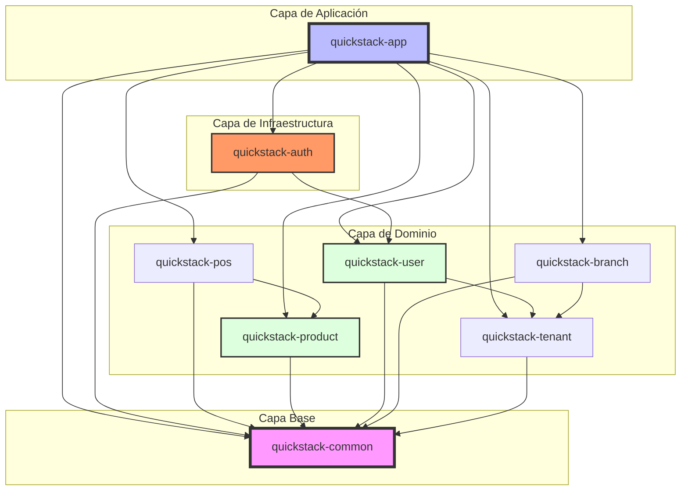

# QuickStack POS - Arquitectura Técnica

> **Última actualización:** 2026-02-20
> **Estado del Proyecto:** Fase 1.1 - Catalog Base (En Progreso)

---

## Stack Tecnológico

### Frontend
| Tecnología | Versión | Propósito |
|------------|---------|-----------|
| React | 19.x | UI Library |
| Vite | 6.x | Build tool |
| TypeScript | 5.x | Type safety |
| Material UI (MUI) | 5.x | Component library |
| Zustand | 5.x | State management |
| TanStack Query | 5.x | Server state / caching |

### Backend
| Tecnología | Versión | Propósito |
|------------|---------|-----------|
| Java | 17 LTS | Runtime |
| Spring Boot | 3.5.x | Framework |
| Spring Data JPA | 3.x | ORM / Data access |
| Spring Security | 6.x | Security Infrastructure |
| JJWT | 0.12.6 | JWT implementation (RS256) |
| PostgreSQL | 16.x | Database (Neon Serverless) |
| Flyway | 10.x | DB migrations |

---

## 1. Estructura del Repositorio (Monorepo)

```
quickstack-pos/
├── frontend/          # React + Vite app (TypeScript)
├── backend/           # Multi-module Maven project (Java 17)
├── docs/              # Technical documentation & flows
└── .github/           # CI/CD Workflows (GitHub Actions)
```

---

## 2. Backend: Arquitectura de Monolito Modular

El backend está organizado en módulos de Maven siguiendo el principio de **"Package by Feature"**, lo que permite una alta cohesión interna y un bajo acoplamiento entre funcionalidades.

### Mapa de Módulos y Dependencias



### Descripción de Módulos

| Módulo | Responsabilidad |
|--------|-----------------|
| `quickstack-app` | **Orquestador:** Punto de entrada `@SpringBootApplication`, configuración global de perfiles y tests E2E. |
| `quickstack-auth` | **Seguridad (AaaS):** Filtros JWT, Rate Limiting, gestión de sesiones (Refresh Tokens), Login y Password Reset. |
| `quickstack-user` | **Identidad:** Gestión de perfiles de usuario, roles y asignación de sucursales. |
| `quickstack-product` | **Catálogo:** Gestión de categorías, productos, variantes y modificadores. |
| `quickstack-tenant` | **Multi-tenancy:** Aislamiento de datos y gestión de suscripciones de restaurantes. |
| `quickstack-common` | **Base Compartida:** DTOs de API, excepciones globales, utilidades de seguridad (PasswordService) y JWT Principal. |

---

## 3. Estrategia de Multi-tenancy

**Aislamiento:** Base de datos compartida con discriminador `tenant_id` en todas las tablas de dominio.

**Implementación Técnica:**
1.  **Extracción:** `JwtAuthenticationFilter` extrae el `tenant_id` del token JWT en cada petición.
2.  **Contexto:** Se almacena en un `ThreadLocal` a través de un `TenantContext` (en el futuro se usará `@TenantScoped`).
3.  **Filtrado:** Todas las consultas a la base de datos **DEBEN** incluir obligatoriamente el filtro `tenant_id`.
4.  **Seguridad DB:** Uso de Claves Foráneas Compuestas `(tenant_id, id)` para garantizar integridad referencial cross-tenant.

---

## 4. Seguridad (OWASP ASVS L2)

### Autenticación y Sesión
*   **Algoritmo JWT:** RS256 (Firma Asimétrica) con rotación de claves soportada.
*   **Almacenamiento:** Access Token en memoria del cliente; Refresh Token en Cookie segura (`HttpOnly`, `Secure`, `SameSite=Strict`, `__Host- prefix`).
*   **Hashing:** Argon2id con sal aleatoria y pepper versionado.
*   **Protección:** Verificación contra contraseñas filtradas (HIBP API) integrada en `quickstack-auth`.

### Defensa en Profundidad
*   **Rate Limiting:** Implementado en `quickstack-auth` usando Bucket4j, limitando peticiones por IP y por Email.
*   **Detección de Reúso:** Si un Refresh Token antiguo es utilizado, se invalida toda la familia de sesiones del usuario.
*   **Auditoría:** Todas las tablas incluyen campos `created_by`, `updated_by` y timestamps de alta precisión.

---

## 5. Estrategia de Testing

| Tipo de Test | Ubicación | Herramientas | Propósito |
|--------------|-----------|--------------|-----------|
| **Unitarios** | Módulo de Feature | JUnit 5, Mockito | Lógica de negocio y servicios aislados. |
| **Slice (Capa)** | Módulo de Feature | `@DataJpaTest`, `@WebMvcTest` | Validar persistencia y contratos de controladores. |
| **E2E (Sistema)** | `quickstack-app` | `@SpringBootTest`, RestAssured | Validar integración completa (Auth -> Negocio -> DB). |

---

## 6. Diagrama de Arquitectura Global

```
┌─────────────────────────────────────────────────────────────┐
│                       CLIENT (React)                         │
│  ┌──────────┐  ┌──────────┐  ┌──────────┐  ┌──────────┐    │
│  │  Zustand │  │ TanStack │  │   Auth   │  │WebSocket │    │
│  │  Store   │  │  Query   │  │  Context │  │  Client  │    │
│  └────┬─────┘  └────┬─────┘  └────┬─────┘  └────┬─────┘    │
└───────┼─────────────┼─────────────┼─────────────┼────────────┘
        │             │             │             │
        └─────────────┴── HTTPS ────┴─────────────┘
                          │
                          ▼
┌─────────────────────────────────────────────────────────────┐
│                    BACKEND (Spring Boot)                     │
│  ┌───────────────────────────────────────────────────────┐  │
│  │        ENTRY POINT (quickstack-app)                   │  │
│  │  ┌──────────────┐  ┌───────────────────────────────┐  │  │
│  │  │     AUTH     │  │        DOMAIN MODULES         │  │  │
│  │  │ (Security/   │  │ (User, Product, Tenant, etc.) │  │  │
│  │  │  Sessions)   │  │                               │  │  │
│  │  └──────┬───────┘  └──────────────┬────────────────┘  │  │
│  │         │                         │                   │  │
│  │  ┌──────┴─────────────────────────┴────────────────┐  │  │
│  │  │              COMMON (Base Library)              │  │  │
│  └──┴────────────────────────┬────────────────────────┴──┘  │
└──────────────────────────────┼──────────────────────────────┘
                               │
                               ▼
┌─────────────────────────────────────────────────────────────┐
│                    DATABASE (PostgreSQL)                     │
│  ┌───────────┐ ┌───────────┐ ┌───────────┐ ┌───────────┐   │
│  │   Auth    │ │   Core    │ │  Catalog  │ │ Inventory │   │
│  │ (Tokens)  │ │ (Tenants) │ │ (Products)│ │           │   │
│  └───────────┘ └───────────┘ └───────────┘ └───────────┘   │
└─────────────────────────────────────────────────────────────┘
```

---

## Registro de Cambios (Changelog)

### 2026-02-20
*   **Modularización del Backend:** Extracción de `quickstack-auth` para centralizar la infraestructura de seguridad.
*   **Desacoplamiento de Identidad:** `quickstack-user` simplificado para enfocarse solo en CRUD de perfiles.
*   **Centralización de Seguridad Base:** Reubicación de `PasswordService` a `quickstack-common` para resolver dependencias circulares.
*   **Renombre de Tests:** Clasificación explícita de `*E2ETest` en el módulo orquestador.

### 2026-02-18
*   Definición inicial de controles ASVS L2 y estrategia de rotación de claves JWT.
