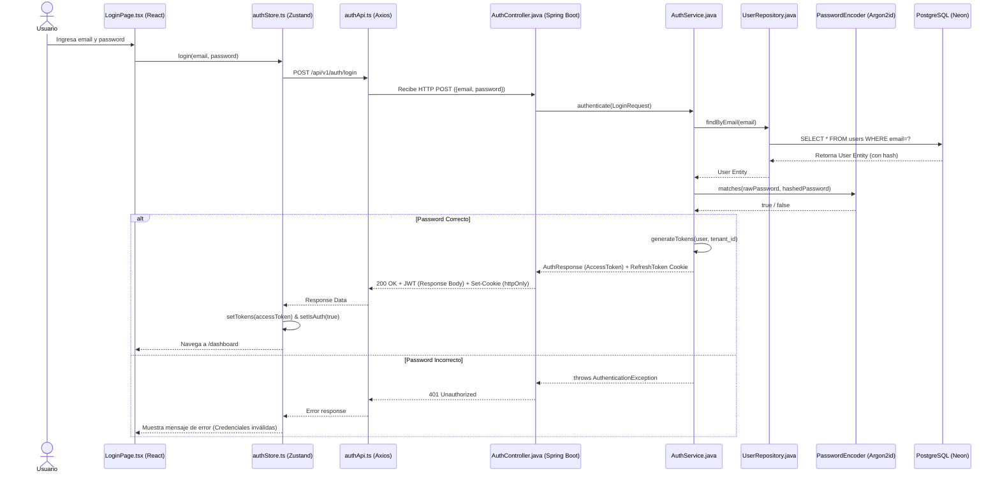
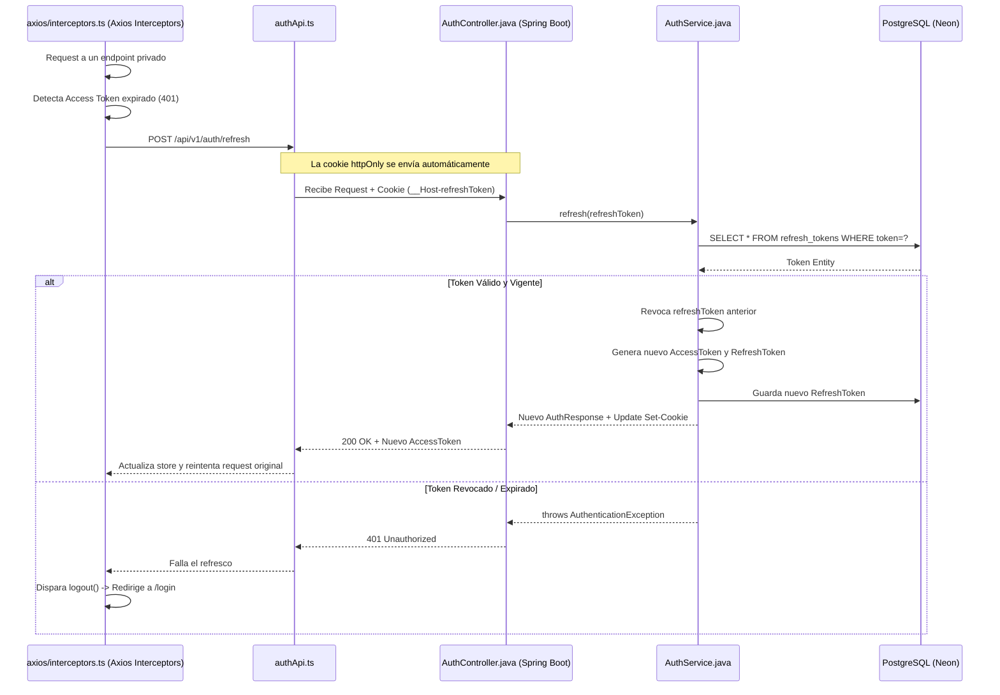
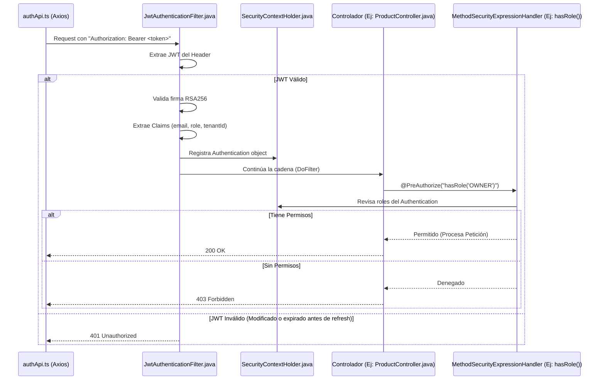

# Flujos de Autenticación y Autorización

Este documento detalla los flujos relacionados con el inicio de sesión, el manejo de sesión (Refresh Token) y la autorización de usuarios, empleando diagramas de nivel de archivo específicos.

## 1. Inicio de Sesión (Login)

Este flujo describe cómo ocurre el inicio de sesión de un usuario desde que ingresa sus credenciales en la interfaz hasta que obtiene un token JWT válido y una cookie de refresh token.

## 2. Refresco de Token (Refresh Token Rotation)

Debido al corto tiempo de vida del Access Token (ej. 15 minutos), la app utiliza el `refreshToken` (almacenado en una cookie `httpOnly`) para obtener un nuevo par de tokens sin requerir que el usuario vuelva a ingresar credenciales.

## 3. Autorización (RBAC) en Requerimientos API

Cuando un usuario autenticado trata de acceder a un endpoint restringido, se ejecutan las validaciones del JWT y del rol asignado.

