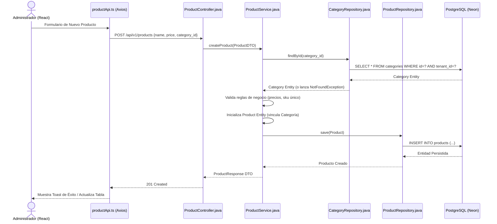
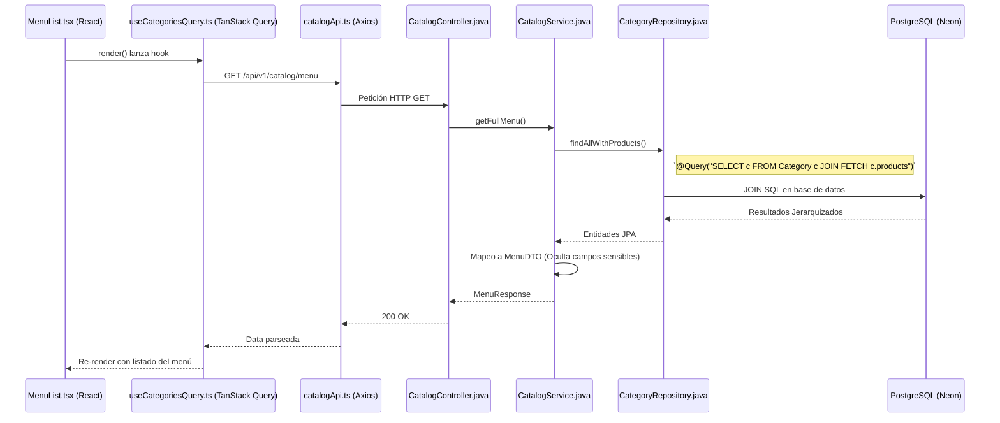

# Flujos de Catálogo e Inventario

Este documento ilustra la interacción para la gestión del catálogo de productos (creación de categorías, productos, modificadores) y su impacto básico en el inventario.

## 1. Creación de un Producto en el Catálogo

Flujo clásico REST para la capa de administración o Backoffice.

## 2. Consulta del Menú (Cajero o Kiosko)

Demuestra cómo se trae la estructura completa del menú jerarquizado para mostrar en el Punto de Venta (Categorías -> Productos).

