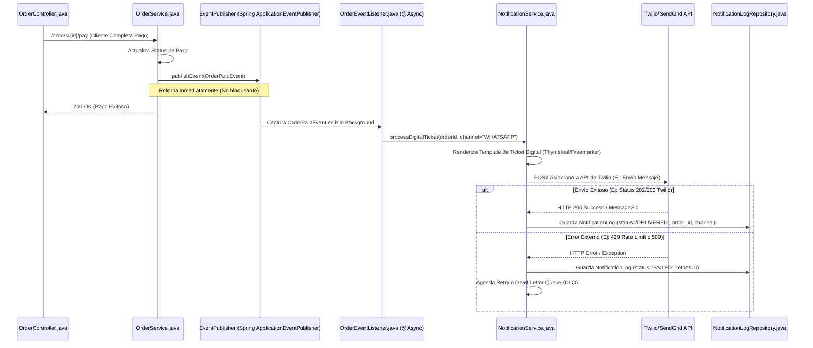

# Flujos de Notificación y Tickets Digitales

Este flujo describe la interacción asíncrona de la aplicación cuando es necesario enviar notificaciones externas (por ejemplo, tickets digitales o confirmaciones de orden) vía Email o WhatsApp sin bloquear el hilo principal.

## 1. Envío Asíncrono de Confirmación / Ticket de Órden

