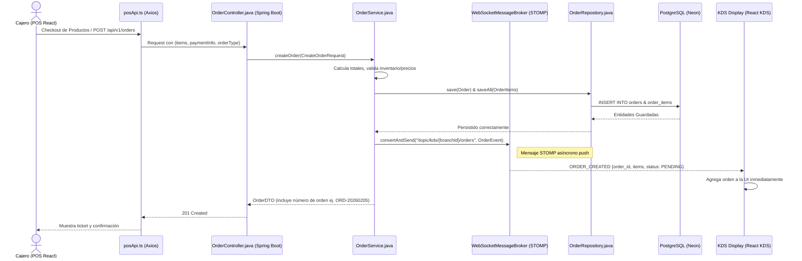
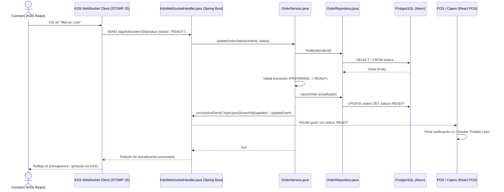

# Flujos de POS y Kitchen Display System (KDS)

Este documento detalla los flujos de interacción en tiempo real para el punto de venta y la pantalla del KDS, utilizando WebSockets para notificaciones instantáneas de las órdenes.

## 1. Creación de una Orden (Desde POS)

Flujo realizado cuando un cajero o mesero registra y envía un nuevo pedido al sistema.

## 2. Actualización de Estado (KDS a POS)

Flujo realizado por el equipo de cocina para actualizar el progreso (ej. de PREPARING a READY) para ser notificado al cajero y eventualmente al cliente.

