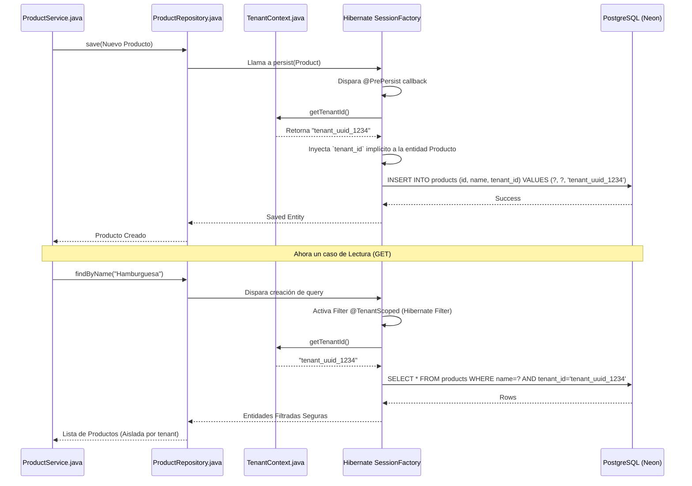

# Flujos de Multi-Tenancy y Aislamiento de Datos

Este documento ilustra la estrategia de la aplicación para resolver de manera segura a qué `tenant` (restaurante/cuenta) pertenece una petición y cómo afecta esto las operaciones de consulta y mutación hacia la base de datos a nivel de archivo.

## 1. Resolución Automática del Tenant por Petición

Toda petición HTTP y WebSocket entrante debe resolverse a un Tenant contextual antes de ser delegada a los controladores.

```mermaid
%%{init: {"themeVariables": {"fontFamily": "arial"}}}%%
sequenceDiagram
    participant API as authApi.ts (o cualquier API)
    participant Spring as DispatcherServlet.java
    participant Filter as TenantFilter.java
    participant JWT as JwtService.java
    participant Context as TenantContext.java (ThreadLocal)
    participant DB as Hibernate / PostgreSQL
    participant Controller as ApiController.java
    
    API->>Spring: GET /api/v1/products + Authorization: Bearer JWT
    Spring->>Filter: Delega petición a TenantFilter (Filtro HTTP)
    
    Filter->>JWT: Extrae `tenant_id` claim del Token (si existe y es válido)
    JWT-->>Filter: "tenant_uuid_1234"
    
    Filter->>Context: setTenantId("tenant_uuid_1234")
    Notice over Context: Tenant grabado en hilo de ejecución (ThreadLocal)
    
    Filter->>Controller: chain.doFilter(request, response)
    
    Controller->>DB: findAllProducts() - Usa Context automáticamente
    
    Notice over Filter: Finalmente (finally block)...
    Filter->>Context: clear() (Limpia recursos/previene leaks)
```

## 2. Inyección de Tenant a nivel Base de Datos (Hibernate / AspectJ)

Demuestra cómo Spring Data JPA intercepta operaciones en base de datos para restringir todos los Selects e Inserts implícitamente mediante el ID grabado.


